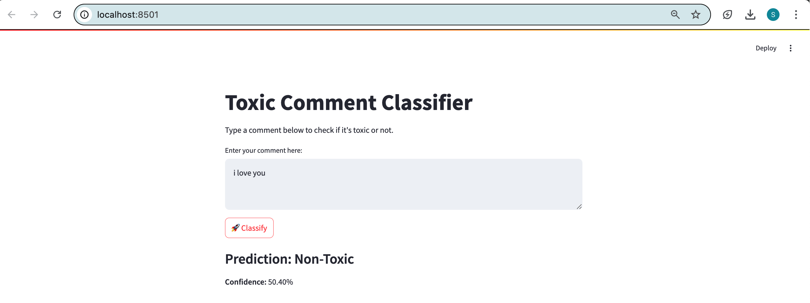
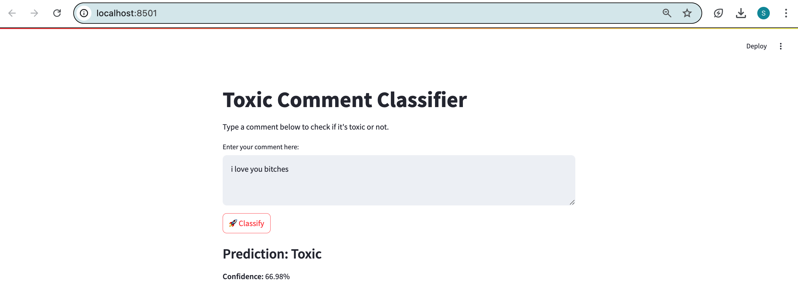

# Toxic Comment Classification with Distilled BERT and LoRA

## Table of Contents
- [Student Information](#student-information)
- [Project Overview](#project-overview)
- [Technologies Used](#technologies-used)
- [Tasks and Implementation](#tasks-and-implementation)
- [Model Evaluation and Comparison](#model-evaluation-and-comparison)
- [Web Application Interface](#web-application-interface)
- [How to Run](#how-to-run)


---

## Student Information

- **Name**: Soe Htet Naing  
- **ID**: st125166  

---

## Project Overview

This project focuses on building a toxic comment detection system using pretrained BERT models and parameter-efficient fine-tuning techniques. The goal is to classify English comments as either **toxic** or **non-toxic** using different training approaches, and deploy the best-performing model in a simple web interface using Streamlit.

---

## Technologies Used

- Python  
- PyTorch  
- Hugging Face Transformers & Datasets  
- PEFT (for LoRA)  
- Streamlit  

---

## Tasks and Implementation

### Task 1: Dataset Preparation

The `wiki_toxic` dataset was loaded from Hugging Face. It contains over 100,000 English comments labeled as toxic (`1`) or non-toxic (`0`). This dataset was split into training, validation, and test sets for consistent evaluation. I only used 10K samples for training and 1.5k samples for validation and testing.

### Task 2: Odd vs. Even Layer Distillation

A 12-layer BERT model was used as the teacher. A 6-layer student model was created for distillation using:
- Odd layers from the teacher: layers {1, 3, 5, 7, 9, 11}
- Even layers from the teacher: layers {2, 4, 6, 8, 10, 12}

Each student model was trained using a combination of cross-entropy loss, KL divergence loss, and cosine similarity.

### Task 3: LoRA Training

A third approach involved applying Low-Rank Adaptation (LoRA) to the full 12-layer BERT model. This allowed efficient fine-tuning with fewer trainable parameters. The LoRA adapters were applied to attention modules (`query` and `key`).

---

## Model Evaluation and Comparison

The models were evaluated on both validation and test sets using accuracy, loss, and F1-score. The F1-score for the **toxic** class was given particular importance due to its relevance in content moderation scenarios.

| Model        | Train Loss | Best Val Acc | Test Accuracy | Toxic F1 | Macro F1 | Test Loss |
|--------------|------------|---------------|----------------|-----------|------------|-------------|
| Odd-Layer    | 0.1815     | 0.9527        | 0.8887         | 0.32       | 0.64        | 0.4310      |
| Even-Layer   | 0.1795     | **0.9547**    | 0.8887         | 0.32       | 0.64        | 0.4310      |
| LoRA         | **0.1648** | 0.9253        | **0.9080**     | 0.19       | 0.57        | **0.2393**  |

### Evaluation Summary

Although the LoRA model achieved the highest test accuracy and lowest test loss, it performed poorly on detecting toxic comments, which is the core objective of this task. Both the Odd-Layer and Even-Layer student models showed better F1-scores for the toxic class, indicating stronger performance on minority class detection.

The Even-Layer Student model had the highest validation accuracy and matched the Odd-Layer in all other aspects. It was selected as the final model for deployment.

---

## Web Application Interface

A Streamlit application was built to provide a simple user interface for real-time toxic comment classification. Users can type any sentence, and the model will return whether it is toxic or not, along with the confidence score.

### Example: Non-Toxic Input
**Input**: `I love you`  
**Prediction**: Non-Toxic  
**Confidence**: ~50.4%

**Screenshot**:  


---

### Example: Toxic Input
**Input**: `I love you bitches`  
**Prediction**: Toxic  
**Confidence**: ~66.9%

**Screenshot**:  


---

## How to Run

To run the web application:

1. Clone this repository or upload the files to your environment.
2. Ensure the following Python packages are installed:
   - `transformers`, `torch`, `streamlit`, `peft`, `datasets`
3. Run the app using:

```bash
streamlit run app.py
